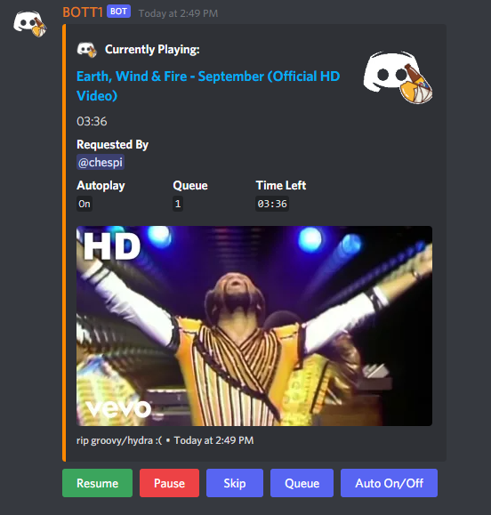
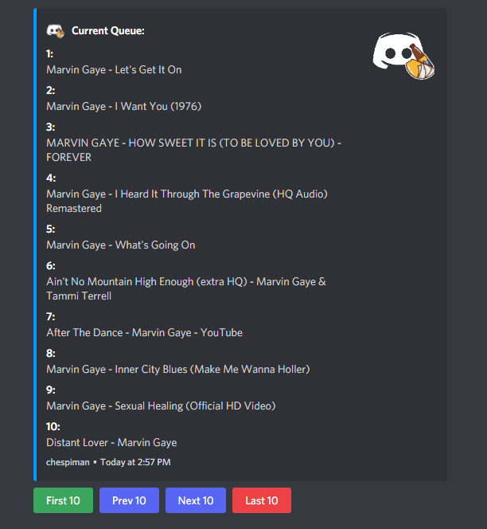

# BOTT1, a discord bot hosted on Heroku:
## Features:
 * Listen to Music or a Livestream from Youtube on your server.
 * Improved interface with buttons allows users to manage the queue without having to type extra commands.
 * Autoplay keeps the music going after the queue ends, based on youtube recommendations. 

## Commands:
* p (query)- Searches for a song/playlist on youtube and plays it on the user's channel.
* queue - Displays the current queue.
* skip - Skips the current song.
* resume/pause - Resumes/Pauses the current song.
* autoplay - Toggles Autoplay On/Off (When Autoplay is on, the bot will continue to play after the queue ends, based on youtube's algorithm). 
* stop - Stops playing the song and leaves the channel.

### Now Playing Message:

### Queue List:

